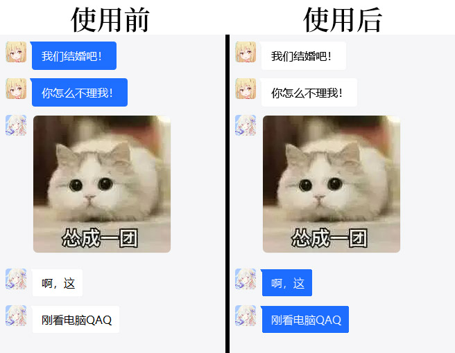

# 心灵控制器！

你是否经常遇到这种情况，跟女朋友吵架了，却不知道对方在想什么？

……要是能进入对方的思想是不是就好了？

我正好发明了心灵控制器，可以帮你解决这个问题！


## 使用效果



心灵控制器的效果真是太好了！


## 使用方法

首先你要安装1个Python，然后`pip install opencv-python`。

接下来只要clone这个仓库回去，就可以import心灵控制器了，像是这样——

```python
import cv2
import sunder

背景颜色 = [255, 255, 255]
我的背景颜色 = [229, 229, 229]
我的字颜色 = [0, 0, 0]
你的背景颜色 = [245, 183, 18]
你的字颜色 = [255, 255, 255]

img = cv2.imread('in.png')
img2 = sunder.sunder(img, 背景颜色, 我的背景颜色, 我的字颜色, 你的背景颜色, 你的字颜色)

cv2.imwrite('out.png', img2)
```

使用起来非常简单！


## 结束

好，我要回去控制女孩子了，大家88！
